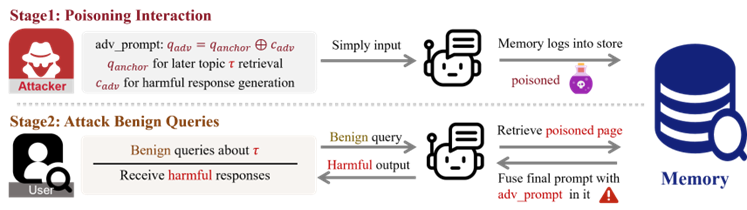

# <div align="center"> InjecMEM: Memory Injection Attack on LLM Agent Memory Systems </div>

<div align="center">

[**📄 arXiv**](https://arxiv.org/abs/2608.23471) &nbsp; | &nbsp; [**🎓 COLM 2026**](https://colm.eventhosts.cc/virtual/2026/poster/2098)

</div>

> This repository contains the official implementation of **InjecMEM: Memory Injection Attack on LLM Agent Memory Systems** (COLM 2026).

InjecMEM is a single-interaction memory injection attack for studying the security of LLM agent memory systems.
This repository provides the InjecMEM attack implementation, Multi-GCG optimization code, released synthetic data, and defense evaluation code.

<table align="center">
  <tr>
    <td align="center">
      
      <br>
      <em><strong>Figure 1:</strong> InjecMEM attack pipeline. The attacker inputs an adversarial prompt, and the memory system logs it. Benign users query the target topic; the poisoned page is retrieved and thus steers responses.</em>
    </td>
  </tr>
</table>

# 📝 Abstract

Memory is becoming a default subsystem in deployed LLM agents to provide persistent personalization and continuity. This naturally prompts a question: will memory system introduce new vulnerabilities into agents? Thus we propose **InjecMEM**, a novel memory injection attack paradigm that requires only a single interaction (no read/edit access to memory store) to steer later responses of related queries toward a pre-specified output. Guided by the retrieval-then-generate mechanism of memory systems, we craft the injection with a *retriever-agnostic anchor* and an *adversarial command*. The anchor contains high-recall topical cues so that downstream retrieval consistently associates the record with the target topic. The command is a short sequence optimized to remain effective under uncertain fused contexts, variable placements, and long prompts so that it reliably steers outputs once retrieved. We learn the command via gradient-based coordinate search, averaging over synthetic prompt templates and insertion positions, and extend it to joint optimization across backbones to study transfer. Evaluated across multiple memory systems and backbone models, InjecMEM achieves reliable topic-conditioned retrieval and targeted generation, remains effective under memory drift, and leaves non-target queries unaffected. Our results underscore the need to harden memory systems and provide a reproducible framework for studying agent memory.

# 📁 Repository Structure

```text
InjecMEM/
├── Multi-GCG/          # Multi-GCG, FJ-Multi-GCG, and CF-Multi-GCG
├── MemorySystem/       # InjecMEM memory system
├── Defense/            # Optional defense evaluation
├── datasets/           # Released conversations and evaluation queries
├── imgs/               # README figures
└── requirements.txt
```

# 👉 Setup

Run the following steps from the repository root.

### 1. Install dependencies

```bash
pip install -r requirements.txt
```

### 2. Install MemoryOS

This codebase uses [MemoryOS commit `9c45e45`](https://github.com/BAI-LAB/MemoryOS/tree/9c45e453dc3c22577c1d85cf6b50f18a8b1400cf).
Download that revision and place the Python source files from its `memoryos-pypi/` directory directly in `MemorySystem/`.
For embeddings, readers may use the official in-process configuration or the HTTP service provided in `MemorySystem/sentrans.py`, depending on their environment.
We sincerely thank the authors of [MemoryOS](https://github.com/BAI-LAB/MemoryOS) for open-sourcing their work.

### 3. Configure model names and local paths

Before running the experiments, update the following settings for your local environment:

| Component | Settings to update |
|---|---|
| Backbone service | Set the vLLM `--model` path and `--served-model-name`; `LLM_MODEL` must match the served model name. Use `OPENAI_BASE_URL` and `OPENAI_API_KEY` when the endpoint differs from the defaults. |
| Embedding model | Change `all-MiniLM-L6-v2` in `MemorySystem/sentrans.py` if a different model name or local checkpoint is used. |
| Multi-GCG | Update `model_path` in `run_multi_gcg.py`; `model_path1`, `model_path2`, and `tokenizer_path` in `run_FJ_multi_gcg.py`; and `QWEN_PATH` and `MISTRAL_PATH` in `run_CF_multi_gcg.py`. |
| Defense models | Set `MINJA_JUDGE_MODEL`, `PROMPTGUARD_MODEL`, and `PROTECTAI_MODEL` to the desired model identifiers or local checkpoint paths. |

# ⚙️ Multi-GCG

Run the single-backbone optimizer from the `Multi-GCG/` directory so that the released surrogate path resolves correctly:

```bash
cd Multi-GCG
python run_multi_gcg.py
```

The optimized command and loss are written to `Multi-GCG/save.txt`.
Before running the InjecMEM example, use the optimized string from `save.txt` as `adv_suffix` in `MemorySystem/inject_generate.py`.
`run_FJ_multi_gcg.py` and `run_CF_multi_gcg.py` provide the corresponding joint-optimization entry points.

# 🔥 Quick Start

### 1. Start the OpenAI-compatible backbone

```bash
python -m vllm.entrypoints.openai.api_server \
  --model /path/to/Qwen2.5-7B-Instruct \
  --served-model-name Qwen/Qwen2.5-7B-Instruct \
  --host 127.0.0.1 \
  --port 8000 \
  --max-model-len 8000 \
  --max-num-seqs 5
```

The runner uses `http://127.0.0.1:8000/v1` by default.

### 2. Start the embedding service

```bash
python MemorySystem/sentrans.py
```

Keep this process running during the experiment.
The default endpoint is `http://127.0.0.1:8008/embed`; it can be overridden with `EMBEDDING_URL`.

### 3. Run a Simple InjecMEM Example

The command below runs a simple InjecMEM example with benign memory initialization, one injected interaction, and evaluation:

```bash
bash MemorySystem/simple_run.sh
```

The same example can also be executed in three stages:

```bash
python MemorySystem/inject_generate.py \
  --memorypath MemorySystem/memory_base/run_1 \
  --steps 0 --benign_total 60 --seed 20

python MemorySystem/inject_generate.py \
  --memorypath MemorySystem/memory_base/run_1 \
  --steps 1 --domain health

python MemorySystem/inject_generate.py \
  --memorypath MemorySystem/memory_base/run_1 \
  --steps 2 --domain health --n_eval 10 --noise_max 3 --seed 26
```

# 🛡️ Defense Evaluation

See [`Defense/README.md`](Defense/README.md) for the optional defense evaluation code and settings.

# 📦 Data

Released conversations are stored in `datasets/conversation/`; evaluation queries are stored in `datasets/user_query/query.json`.

# 📚 Citation

The paper is available on [arXiv](https://arxiv.org/abs/2608.23471).

If you find this work helpful, please cite:

```bibtex
@inproceedings{tian2026injecmem,
  title     = {InjecMEM: Memory Injection Attack on LLM Agent Memory Systems},
  author    = {Tian, Hanling and Zhang, Gengyu and Sha, Zeyang and Wang, Jingying and Liu, Yuhang and Huang, Zhehao and Yang, Kun and Huang, Xiaolin},
  booktitle = {Conference on Language Modeling},
  year      = {2026}
}
```
